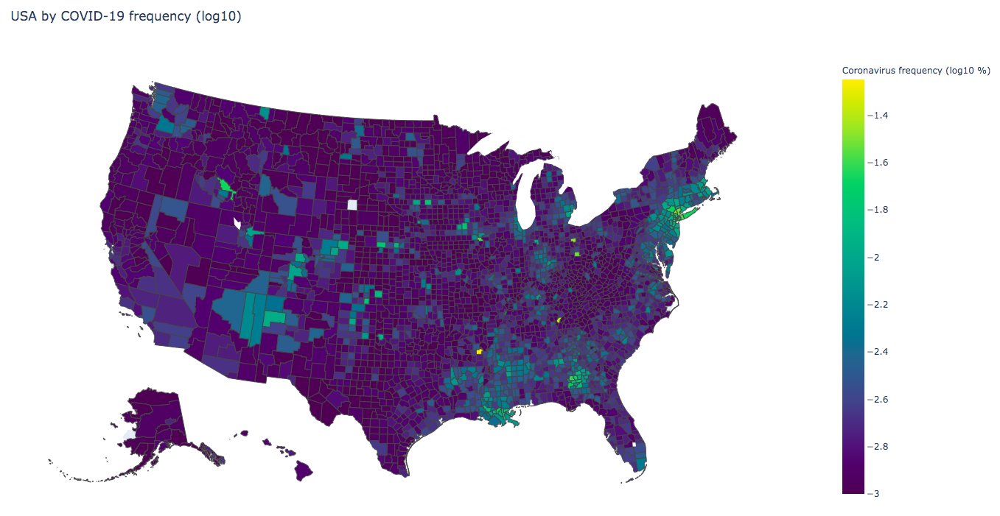

# COVID-19 Research: Team 3 (Risk Factors) #

## Installment ##

To run this code, you only need the requirements listed in `requirements.txt` and you can install them by running `pip install -r requirements.txt` in your working directory. Running `bash test_plots.sh` should plot each individual map in a browser.

## Data ##

Source for Diabetes Data: US Diabetes Surveillance System; www.cdc.gov/diabetes/data; Division of Diabetes Translation - Centers for Disease Control and Prevention.
Source for Chloropleth help: https://plotly.com/python/choropleth-maps/

## Django ##

The test site runs using django, which is a tool for connecting html frontend with python backend. To install it you can just run `pip install django` in your local or virtual environment. To run the site on a localhost, you can run `python django_site/manage.py runserver` and open the link to the localhost it tells you it's running on. Important files are `django_site/plotter/views.py`, which is where I get the html source code from `asthma/plot_asthma` and then pass it on to `django_site/plotter/templates/plotter/home.html`, which is the html page that renders the asthma plot. This is all a very dry run, so if we want to go down this route we should make the directories cleaner by moving all relevant files into `django_site/` to avoid weird relative imports before doing anything else.