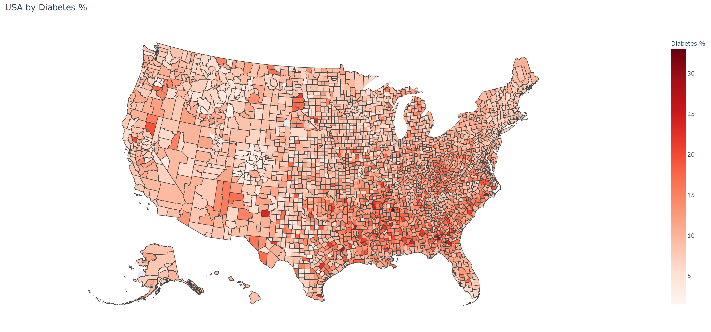

# USA-mapping

To run this code, you only need the requirements listed in `requirements.txt` and you can install them by running `pip install -r requirements.txt` in your working directory. Running `testing.py` should plot the USA choropleth map.

Source for diabetes data: US Diabetes Surveillance System; www.cdc.gov/diabetes/data; Division of Diabetes Translation - Centers for Disease Control and Prevention.
Source for chloropleth help: https://plotly.com/python/choropleth-maps/

